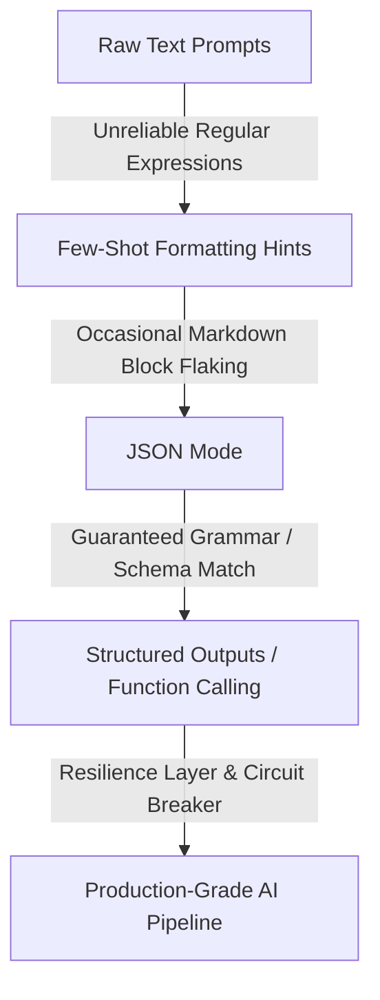
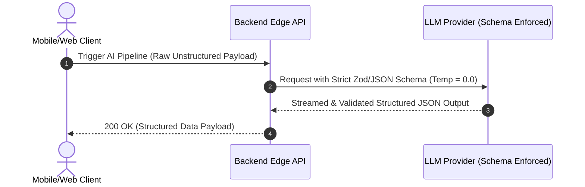

## The Determinism Dilemma in LLM Applications

As full-stack developers and architects, we are conditioned to expect determinism. A function given input $A$ should consistently yield output $B$. However, integrating Large Language Models (LLMs) introduces stochastic behavior into our tech stacks. Traditional natural language outputs are excellent for chatbots, but they break production software pipelines that rely on strict schemas, database constraints, and downstream API contracts.

To build production-ready AI features, we must force these probabilistic engines to emit structured, deterministic data structures—typically JSON—while maintaining high runtime reliability.

### The Evolution of Structure



---

## Architectural Patterns for Structured AI Outputs

To reliably extract data from an LLM into an enterprise application workflow, three core layers must be implemented in the ingestion pipeline:

1. **Schema Definition Layer:** Defining the strict programmatic contract using validation engines like Pydantic (Python) or Zod (TypeScript).
2. **Execution & Constraint Layer:** Utilizing the LLM provider's native schema enforcement engines (such as OpenAI's `response_format` with JSON schema enforcement, or Anthropic's tool use mechanisms). This forces the model's token-selection probabilities to match a context-free grammar constraints engine.
3. **Resilience & Validation Layer:** Running post-execution runtime validation and automatic self-healing/retry loops if structural schemas fail validation due to context exhaustion or token clipping.

### End-to-End System Architecture

Below is the architecture for a decoupled, highly reliable AI data-extraction pipeline.



---

## Concrete Engineering Implementation

To make this design actionable, we implement the core architecture using Node.js, `zod` for verification, and standard SDK interfaces configuring structured output formats.

### The Ingestion Pipeline Engine

Below is the core code engine designed to execute within an isolated pipeline step, containing explicit schema declarations and state self-healing mechanics.

```javascript
import { z } from 'zod';

// 1. Definition Layer: Enforce our strict business logic layout
export const DataExtractionSchema = z.object({
  sentiment: z.enum(['positive', 'neutral', 'negative']),
  confidenceScore: z.number().min(0).max(1),
  tags: z.array(z.string()),
  summary: z.string().max(280),
  entitiesExtracted: z.array(z.object({
    name: z.string(),
    type: z.string()
  }))
});

/**
 * Executes a deterministic pipeline call against an LLM endpoint
 * @param {string} rawInputText - Unstructured source text data
 * @param {object} sdkClient - Initialized SDK client instance
 * @returns {Promise<z.infer<typeof DataExtractionSchema>>}
 */
export async function runDeterministicPipeline(rawInputText, sdkClient) {
  const maxRetries = 3;
  let attempt = 0;

  while (attempt < maxRetries) {
    try {
      // 2. Execution & Constraint Layer: Target low variance configuration
      const response = await sdkClient.models.generateContent({
        model: 'gemini-2.5-pro',
        contents: `Analyze the following incoming core system log data:\n\n${rawInputText}`,
        config: {
          // Setting temperature to 0 minimizes randomness in token sampling selection
          temperature: 0.0, 
          responseMimeType: 'application/json',
          responseSchema: DataExtractionSchema,
        }
      });

      const rawJsonString = response.text;
      
      // 3. Resilience & Validation Layer: Parse step execution
      const validatedData = DataExtractionSchema.parse(JSON.parse(rawJsonString));
      return validatedData;

    } catch (error) {
      attempt++;
      console.warn(`Pipeline failure detected on execution attempt ${attempt}/${maxRetries}: ${error.message}`);
      if (attempt >= maxRetries) {
        throw new Error(`Pipeline Circuit Breaker Tripped: Failed to achieve determinism after ${maxRetries} attempts.`);
      }
    }
  }
}
```

---

## Production Best Practices

* **Enforce Zero Temperature:** Always scale your target parameter space temperature down to explicitly `0.0`. This locks the log-likelihood profiles down to greedy decoding paths, forcing consistent execution outcomes.
* **Token Budgeting Overhead:** Structured schema processing options require up to 1.5x more token overhead generation buffers due to structural key repeating syntax overhead. Establish rigorous token usage budgets.
* **Schema Evolution Gaps:** When changing a backend schema structure, update the LLM pipeline runtime configuration *before* deprecating previous properties inside downstream database configurations to prevent breaking structural parsing transitions.
