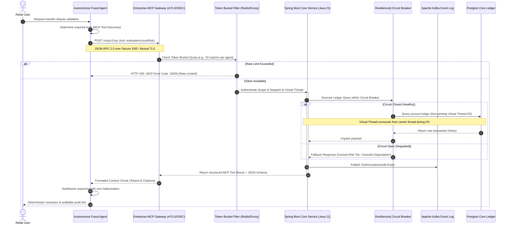

# Model Context Protocol (MCP) in Enterprise Production: Bridging Core Banking to Autonomous Agents with Virtual Concurrency

Every enterprise engineering team building LLM integrations eventually runs headfirst into the **"n-by-m connector crisis"**. 

Imagine if every smartphone manufacturer created their own unique shape for charging cables, audio jacks, and data sync. In the early days of personal electronics, that was reality. Then the industry agreed upon USB-C—a single, bidirectional, universal physical and data protocol that any peripheral could plug into.

In the AI ecosystem, the **Model Context Protocol (MCP)** is our USB-C. Instead of writing proprietary Python glue code for every Claude, OpenAI, or Gemini model to talk to your enterprise Oracle ledgers, Kafka event logs, and customer 360 microservices, MCP defines a secure, JSON-RPC 2.0 based protocol over standard transports (HTTP/SSE and Stdio).

In this deep dive, we architect a production-grade MCP tool server hosted inside an existing enterprise Spring Boot microservice, powered by **Java 21 Virtual Threads** and **Spring AI**, delivering sub-millisecond context retrieval to autonomous agents without blocking OS threads.


---

## 1. High-Level Architectural Blueprint

In an enterprise banking environment, autonomous agents must never have raw database credentials or uncontrolled execution privileges. The MCP Server acts as an audited, rate-limited, authenticated boundary layer. 

The following sequence diagram illustrates the lifecycle of a high-value transaction risk assessment request initiated by a customer care multi-agent supervisor, detailing token bucket ingress throttling, zero-trust validation, and carrier unpinning.



---

## 2. Why Java 21 Virtual Threads Matter (and the Carrier Thread Pinning Trap)

When autonomous multi-agent loops operate at scale, a single user prompt might trigger dozens of parallel MCP tool inquiries (e.g., retrieving credit rating, transaction history, KYC status, and fraud heuristic scores). 

In legacy Java thread-per-request models, 200 concurrent agent requests making 10 tool calls each would instantaneously exhaust the 2,000 OS thread limit of a container, leading to thread starvation and cascading HTTP 504 gateway timeouts.

With **Java 21 Project Loom (Virtual Threads)**, carrier threads are unmounted when an MCP call blocks on network I/O or database queries, allowing millions of concurrent agent context lookups with a negligible memory footprint.

### The Carrier Thread Pinning Hazard
However, virtual threads introduce a subtle enterprise failure mode: **Carrier Thread Pinning**.

When a virtual thread executes a blocking operation inside a `synchronized` block or method, or calls native code via JNI, the virtual thread is **pinned** to its underlying carrier OS thread (`ForkJoinWorkerThread`). It cannot unmount. Under agent-driven retry storms, a cluster of pinned carrier threads causes the entire virtual thread scheduler pool to stall, collapsing server throughput back to legacy levels.

```
[❌ PINNED STATE - Anti-Pattern]
VirtualThread #42  ──(inside synchronized method)──>  Carrier Thread #3 [STUCK / PINNED on DB I/O]

[✅ UNPINNED STATE - Production Pattern]
VirtualThread #42  ──(using ReentrantLock)──>  Carrier Thread #3 [FREED FOR OTHER WORK]
      │
      └──> (Parked in Heap until I/O completes)
```

To eliminate pinning hazards in enterprise MCP servers:
1. Replace all legacy `synchronized (lock)` primitives with `java.util.concurrent.locks.ReentrantLock`.
2. Avoid third-party legacy JDBC or serialization drivers that synchronize socket reads.
3. Validate runtime unpinning using the JVM diagnostic flag:  
   `-Djdk.tracePinnedThreads=full`.

---

## 3. Production Implementation: The Enterprise MCP Tool Provider

Here is the concrete, production-grade Spring Boot 3.3+ implementation exposing an MCP Tool Controller with **Token Bucket Rate Limiting**, **ReentrantLock (carrier unpinning)**, **Resilience4j Circuit Breakers**, and **Virtual Thread execution**.

```java
package com.enterprise.banking.mcp.tools;

import com.fasterxml.jackson.annotation.JsonProperty;
import com.fasterxml.jackson.annotation.JsonPropertyDescription;
import io.github.resilience4j.circuitbreaker.annotation.CircuitBreaker;
import io.github.resilience4j.ratelimiter.annotation.RateLimiter;
import io.micrometer.observation.annotation.Observed;
import org.slf4j.Logger;
import org.slf4j.LoggerFactory;
import org.springframework.security.access.prepost.PreAuthorize;
import org.springframework.stereotype.Service;

import java.math.BigDecimal;
import java.time.Instant;
import java.util.List;
import java.util.concurrent.TimeUnit;
import java.util.concurrent.locks.ReentrantLock;

/**
 * Enterprise MCP Tool Service for Autonomous Banking Agents.
 * Concurrency: Java 21 Virtual Threads without Carrier Pinning.
 * Guardrails: Token Bucket Rate Limiting, Resilience4j Circuit Breaker, mTLS Scopes.
 */
@Service
public class AccountRiskMcpToolService {

    private static final Logger log = LoggerFactory.getLogger(AccountRiskMcpToolService.class);
    
    private final TransactionLedgerRepository ledgerRepository;
    private final AuditKafkaProducer auditProducer;
    
    // Explicit ReentrantLock replaces 'synchronized' to prevent Carrier Thread Pinning in Loom
    private final ReentrantLock stateLock = new ReentrantLock();

    public AccountRiskMcpToolService(TransactionLedgerRepository ledgerRepository, AuditKafkaProducer auditProducer) {
        this.ledgerRepository = ledgerRepository;
        this.auditProducer = auditProducer;
    }

    // Input DTO with self-describing JSON Schema annotations for Agent Tool Discovery
    public record RiskAssessmentInput(
        @JsonProperty(required = true)
        @JsonPropertyDescription("The canonical masked enterprise customer identifier (e.g., CUST-98214)")
        String customerId,

        @JsonProperty(required = true)
        @JsonPropertyDescription("Threshold amount in USD to flag anomalies for rapid escalation")
        BigDecimal thresholdAmount,

        @JsonPropertyDescription("Lookback window in days (default: 30)")
        Integer lookbackDays
    ) {}

    // Output DTO returned in standard MCP envelope format
    public record RiskAssessmentResult(
        String customerId,
        BigDecimal totalVolume30d,
        int anomalyCount,
        boolean requiresHumanEscalation,
        boolean degradedFallback,
        Instant evaluationTimestamp,
        String auditTraceId
    ) {}

    @Observed(name = "mcp.tool.evaluate_account_risk")
    @PreAuthorize("hasAuthority('SCOPE_mcp:banking:read')")
    @RateLimiter(name = "mcpTokenBucketLimiter", fallbackMethod = "rateLimitFallback")
    @CircuitBreaker(name = "ledgerCoreCircuitBreaker", fallbackMethod = "ledgerFallback")
    public RiskAssessmentResult evaluateAccountRisk(RiskAssessmentInput input) {
        log.info("Processing MCP tool invocation for customer={} on VirtualThread={}", 
                 input.customerId(), Thread.currentThread().isVirtual());

        int days = (input.lookbackDays() != null && input.lookbackDays() > 0) ? input.lookbackDays() : 30;

        // Carrier Thread Safe: ReentrantLock unmounts virtual thread cleanly if waiting
        try {
            if (!stateLock.tryLock(500, TimeUnit.MILLISECONDS)) {
                throw new IllegalStateException("Tool concurrency lock acquisition timed out");
            }
            try {
                // Virtual thread unmounts from carrier thread during non-blocking socket I/O
                List<TxRecord> transactions = ledgerRepository.findSettledTransactions(input.customerId(), days);
                
                BigDecimal totalVolume = transactions.stream()
                        .map(TxRecord::amount)
                        .reduce(BigDecimal.ZERO, BigDecimal::add);

                long anomalies = transactions.stream()
                        .filter(tx -> tx.amount().compareTo(input.thresholdAmount()) > 0)
                        .count();

                boolean escalate = anomalies >= 2 || totalVolume.compareTo(new BigDecimal("100000.00")) > 0;
                String traceId = "AUDIT-MCP-" + System.currentTimeMillis();

                auditProducer.sendAuditRecord(new McpInvocationLog(
                        traceId, 
                        input.customerId(), 
                        "evaluateAccountRisk", 
                        escalate
                ));

                return new RiskAssessmentResult(
                        input.customerId(),
                        totalVolume,
                        (int) anomalies,
                        escalate,
                        false,
                        Instant.now(),
                        traceId
                );
            } finally {
                stateLock.unlock();
            }
        } catch (InterruptedException e) {
            Thread.currentThread().interrupt();
            throw new RuntimeException("Virtual thread interrupted during lock acquisition", e);
        }
    }

    /**
     * Circuit Breaker Fallback: Returns safe degraded state if Core Ledger is down.
     */
    public RiskAssessmentResult ledgerFallback(RiskAssessmentInput input, Throwable t) {
        log.warn("Ledger Core Circuit Breaker OPEN. Returning degraded fallback for customer={}. Root cause: {}", 
                 input.customerId(), t.getMessage());
        
        return new RiskAssessmentResult(
                input.customerId(),
                BigDecimal.ZERO,
                0,
                true, // Fail safe: trigger human escalation when ledger fails
                true,
                Instant.now(),
                "FALLBACK-CIRCUIT-OPEN"
        );
    }

    /**
     * Rate Limiter Fallback: Throttles aggressive multi-agent reasoning loops.
     */
    public RiskAssessmentResult rateLimitFallback(RiskAssessmentInput input, Throwable t) {
        log.error("MCP Tool Token Bucket Rate Limit EXCEEDED for agent invoking customer={}", input.customerId());
        throw new McpRateLimitExceededException("Rate limit exceeded for tool 'evaluateAccountRisk'. Back off and retry.");
    }
}
```

---

## 4. MCP Agent Client Orchestration (Python SSE Client)

On the agentic orchestration side, enterprise multi-agent supervisors connect dynamically to our Spring Boot MCP server over an encrypted Server-Sent Events (SSE) channel:

```python
from mcp import ClientSession
from mcp.client.sse import sse_client
import asyncio
import os

async def query_enterprise_mcp_agent(customer_id: str, threshold: float):
    """
    Connects to the enterprise Spring Boot MCP SSE server over mutual TLS
    and executes verified tool discovery and execution.
    """
    mcp_endpoint = os.getenv("ENTERPRISE_MCP_SSE_URL", "https://core-banking.internal/mcp/sse")
    bearer_token = os.getenv("AGENT_OIDC_TOKEN")
    
    headers = {
        "Authorization": f"Bearer {bearer_token}",
        "X-Agent-ID": "agent-fraud-supervisor-01"
    }
    
    async with sse_client(mcp_endpoint, headers=headers) as (read_stream, write_stream):
        async with ClientSession(read_stream, write_stream) as session:
            # 1. Initialize Handshake & Capabilities
            await session.initialize()
            
            # 2. Dynamic Tool Discovery
            available_tools = await session.list_tools()
            print(f"[Agent] Discovered {len(available_tools.tools)} enterprise MCP tools")
            
            # 3. Call the Java 21 Spring Boot Tool
            try:
                result = await session.call_tool(
                    "evaluateAccountRisk",
                    arguments={
                        "customerId": customer_id,
                        "thresholdAmount": threshold,
                        "lookbackDays": 45
                    }
                )
                return result.content[0].text
            except Exception as e:
                # Handles Token Bucket 429 and Circuit Breaker exceptions deterministically
                print(f"[Agent Protocol Error]: {e}")
                raise

if __name__ == "__main__":
    result = asyncio.run(query_enterprise_mcp_agent("CUST-98214", 5000.0))
    print(f"[Agent Execution Result]:\n{result}")
```

---

## 5. Architectural Checklist for Enterprise Production

Before promoting your MCP deployment from staging to live banking or enterprise traffic, verify these seven architectural invariants:

1. **Token Bucket Rate Limiting:** Enforce bucket quotas per calling agent ID at the ingress and SSE transport layers to prevent recursive LLM tool-calling loops from swamping backend services.
2. **Carrier Thread Unpinning:** Audit your codebase and libraries using `-Djdk.tracePinnedThreads=full`. Eliminate `synchronized` blocks in favor of `ReentrantLock` across all virtual thread paths.
3. **Strict Transport Security (mTLS / OIDC):** Never expose plain HTTP MCP endpoints. Always terminate at an enterprise ingress enforcing JWT token validation and mutual TLS client certificates.
4. **Circuit Breaker Fallbacks:** Wrap high-latency MCP tool invocations with Resilience4j circuit breakers to return graceful degraded payloads (`requiresHumanEscalation = true`) when dependencies fail.
5. **Virtual Thread ThreadLocal Hygiene:** Ensure libraries do not pool Virtual Threads or store heavy session context in `ThreadLocal`, which causes memory bloat.
6. **Idempotency Keys:** Every tool modifying state must require an `idempotency_key` UUID from the calling agent to prevent double-charging or repeated ledger mutations.
7. **Structured Concurrency Guardrails:** Use Java 21 `StructuredTaskScope.ShutdownOnFailure` when fanning out multiple downstream database inquiries.

---

### Conclusion & What's Next
The Model Context Protocol eliminates the bespoke integration friction that has stalled enterprise agent deployments over the last 18 months. By pairing the universal standardization of MCP with the rock-solid throughput of Java 21 Virtual Threads, unpinned synchronization, and resilient rate limiting, enterprise architects can safely unlock autonomous systems without sacrificing governance, security, or performance.